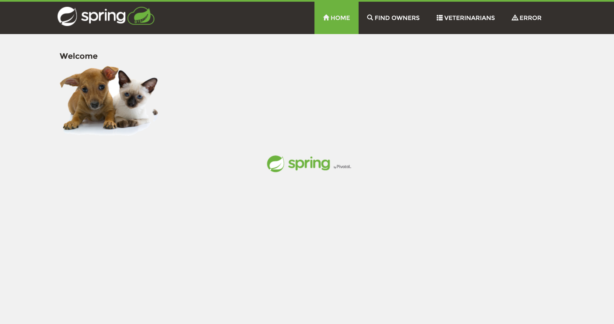

<!--

This file is a template to help you get started writing a "conceptual" article.
Read our writing guidelines for more information on how to write articles for
the Rancher community:

    https://rancher.com/writing-program/writing-guidelines

-->
---
title: "A developers introduction to buildpacks"
author: Matthew Casperson
date: 05/31/2021
description: "Learn how buildpacks evolved and the benefits they can bring to developer's workflows"
type: "blog"
tags: ["Conceptual"]
categories: [blog]
image: ""
draft: true
---

<!-- In the front matter above, fill out the title, author, and description
fields. -->

## Introduction

<!-- Include paragraphs describing article scope, why it's helpful, who should
read it, and what the reader will learn. -->

Compiling software is not a glamourous job, but it is a critical part of every developer's workflow. The process of compiling software has evolved over the decades moving from developers building artifacts locally, to centralized build servers, to multistage Docker images, and now to a relatively new process called buildpacks.

In this post we'll look at the history of compiling software and see how buildpacks have evolved to provide developers with an opinionated and convenient process for building their source code.

## The history of compiling software

Not so long ago it was common for a developer on a team to perform a release by compiling code on their local workstation, generating deployable artifacts, and performing a deployment using tools like FTP or RDP onto a server. This process had some obvious limitations: it was not reproducible, it was entirely manual, and it depended on an individual's workstation to be properly configured with all the required platforms and scripts required to complete a build.

Build servers, often called Continuous Integration (CI) servers, were the next logical step. A CI server provides a source of truth, where the process of testing and building code is centrally defined and managed. Traditionally, the build process is defined as a series of steps configured through a web console, although more recently those steps are defined as code and checked in alongside the application source code. By automating the process of testing and building code, a CI server allows code changes to be continuously built as a shared Source Control Management (SCM) system receives new code commits.

CI servers still require a great deal of specialized configuration though. The Software Development Kits (SDKs) for the various languages used to write applications must be installed, as well as project and package management tools. Nowadays languages release new versions multiple times a year, which can place a burden on CI servers to maintain multiple SDKs side by side to accommodate software projects that upgrade to new language versions at differing rates. In addition, the CI build steps require a particular CI server to execute them. So even if the step configuration has been expressed as code and checked in alongside the application code, only a particular CI server can execute those steps, and they are not generally reproducible on a developer's local machine.

These problems are neatly solved by using Docker. Each Docker image provides an isolated file system, allowing entire build chains to exist within their own independent Docker image. This means even software that has no native support for installing and running multiple versions can exist side by side in their own Docker images. And by using [multistage Docker builds](https://docs.docker.com/develop/develop-images/multistage-build/), it is possible to define the steps and environment required to build application code with instructions that can be executed by any server or workstation with Docker installed.

The isolated nature of Docker images can present a challenge when building software though. Most applications these days rely on dozens, if not hundreds, of external dependencies that must be downloaded from the internet. A naive implementation of a Docker build script will result in these dependencies being downloaded with each and every build. It is not uncommon for an application to download hundreds of megabytes worth of dependencies, and so without care, compiling applications using Docker can be extremely inefficient.

Still, Docker's ability to precisely define the environment in which an application is built, to allow multiple such definitions to painlessly coexist on a single machine, and to allow builds to be performed anywhere Docker is installed, makes it a very compelling platform to build software in. The only thing missing is the ability to abstract away the highly specialized processes required to efficiently build software using Docker.

This is where [buildpacks](https://buildpacks.io/) come in. A buildpack implements an opinionated build process within a Docker container that takes care of all the fiddly aspects of managing SDKs, caching dependencies, and reducing build times to create an executable Docker image from the supplied source code. This means developers can write their code as they always have (with no Docker build scripts), compile that code with a buildpack, and have their compiled application embedded into an executable Docker image.

Buildpacks are:
* Convenient, as their opinionated workflows require no special knowledge to use, and are trivial to execute.
* Efficient, as they are specially designed to leverage Docker's functionality ensuring builds are as fast as possible.
* Repeatable, requiring only one application to be installed alongside Docker to build any number of languages.
* Flexible, with an open specification allowing anyone to define their own build process.

For all these benefits though, buildpacks are not a complete replacement for your CI system. For a start, buildpacks only generate Docker images. If you deploy applications to a web or application server, buildpacks won't generate the kind of traditional artifacts you need. It is also quite likely that you will execute buildpacks on a CI server to retain the benefits of a centralized source of truth.

To demonstrate just how powerful buildpacks are, let's take a typical Java application that has no Docker build configurations and create an executable Docker image with a buildpack.

## Building an example application

[Petclinic](https://github.com/spring-projects/spring-petclinic) is a sample Java Spring web application that has been lovingly maintained over the years as a demonstration of the Spring platform. It represents the kind of code base you would find in many engineering departments. Although the git repository contains a `docker-compose.yml` file, this is only to run a MySQL database instance. Neither the application source code nor the build scripts provide any facility to build Docker images.

Clone the git repository with the command:

```
git clone https://github.com/spring-projects/spring-petclinic.git
```

In order to use buildpacks, ensure you have [Docker](https://www.docker.com/) installed.

To build the sample application with a buildpack, we'll need to install what is known as a *[platform](https://buildpacks.io/docs/concepts/components/platform/)*, which in our case is a CLI tool called `pack`. Instructions for installing `pack` can be found [here](https://buildpacks.io/docs/tools/pack/), with packages available for most major operating systems.

When you first run `pack` you will be prompted to configure a default builder. We'll cover terminology like *[builder](https://buildpacks.io/docs/concepts/components/builder/)* in subsequent posts, but for now all we need to understand is that a builder contains the buildpacks that compile our code, and that companies like Heroku and Google, and groups like Paketo, provide a number of builders we can use. 

Here is the output of `pack` asking us to define a default builder:

```
Please select a default builder with:

        pack config default-builder <builder-image>

Suggested builders:
        Google:                gcr.io/buildpacks/builder:v1      Ubuntu 18 base image with buildpacks for .NET, Go, Java, Node.js, and Python
        Heroku:                heroku/buildpacks:18              Base builder for Heroku-18 stack, based on ubuntu:18.04 base image
        Heroku:                heroku/buildpacks:20              Base builder for Heroku-20 stack, based on ubuntu:20.04 base image
        Paketo Buildpacks:     paketobuildpacks/builder:base     Ubuntu bionic base image with buildpacks for Java, .NET Core, NodeJS, Go, Ruby, NGINX and Procfile
        Paketo Buildpacks:     paketobuildpacks/builder:full     Ubuntu bionic base image with buildpacks for Java, .NET Core, NodeJS, Go, PHP, Ruby, Apache HTTPD, NGINX and Procfile
        Paketo Buildpacks:     paketobuildpacks/builder:tiny     Tiny base image (bionic build image, distroless-like run image) with buildpacks for Java Native Image and Go

Tip: Learn more about a specific builder with:
        pack builder inspect <builder-image>
```

We'll make use of the Heroku Ubuntu 20.04 builder, which we configure with the command:

```
pack config default-builder heroku/buildpacks:20
```

Then, in the `spring-petclinic` directory, run the command:

```
pack build myimage
```

It is important to note that we do not need to have the Java Development Kit (JDK) or Maven installed for `pack` to build our source code. We also don't need to tell `pack` that we are trying to build Java code. The Heroku builder (or any other builder you may be using) conveniently takes care of all of this for us.

The first time you run a build, all of the application dependencies are downloaded. And there are a lot! On my home internet connection, it took around 30 minutes to complete the downloads. Once these downloads complete, the application is compiled, and a Docker image called `myimage` is created. We can verify this by running the command:

```
docker image ls --filter reference=myimage
```

To run the Docker image, run the command:

```
docker run -p 8080:8080 myimage
```

The resulting web application has been exposed on port 8080, so we can access it via the URL http://localhost:8080. You will see a page like this:



It is worth taking a moment to appreciate what we just achieved here. With a single command we compiled source code that had no Docker configuration into an executable Docker image. We never needed to install any Java tooling, and never needed to configure any Java settings.

To verify that the application dependencies were cached, run `pack build myimage2`. Notice this time the build process completes much faster as all the downloads from the previous build are reused. This demonstrates how buildpacks provide an efficient build process.

The process we just ran through here is also easily repeated on any machine with Docker and the `pack` CLI installed. It would take very little to recreate this process in a CI server, meaning builds on a centralized build server and local developers machines work the same way.

## Conclusion

The evolution of building software has seen engineering teams go from building on their local machines, to building via a CI server, to multistage Docker builds. Buildpacks take the best ideas from all of these practices to provide a build process that is identical whether run on a developers local machine or on a CI server, while taking advantage of the isolation and reproducibility of Docker, without the overhead of forcing every developer to craft a best practice Docker build script.

In this post we demonstrated how publicly available buildpacks can be used to quickly compile a traditional Java application into an executable Docker image. 

For those looking to customize their build experience, in the next blog post we create a simple buildpack of our own to compile a Java application with Maven.

